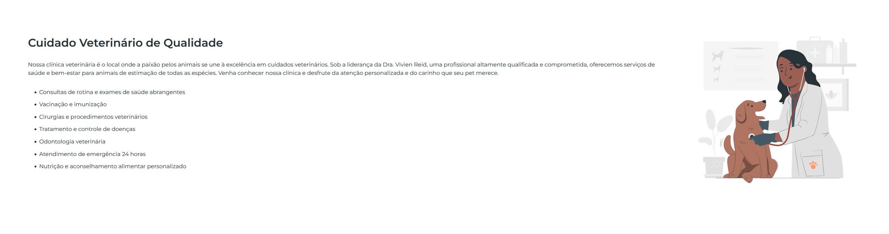

# 🐾 PetLife

🌟 Garanta uma vida longa e cheia de alegria para o seu melhor amigo!

O PetLife é um site fictício que apresenta uma clínica veterinária, petshop e farmácia. Ele foi desenvolvido com HTML, CSS e JavaScript para oferecer uma experiência interativa e moderna para os usuários.

### 🚀 Tecnologias utilizadas

    HTML5 → Estruturação do site
    CSS3 → Estilização e design responsivo
    JavaScript → Interatividade nas seções de dúvidas

### 🎯 Funcionalidades

✔️ Página inicial com introdução sobre a clínica
✔️ Seção sobre os serviços veterinários oferecidos
✔️ Informações sobre o petshop e farmácia
✔️ FAQ interativo para esclarecer dúvidas dos clientes
✔️ Design moderno e amigável

### 📷 Captura de tela

### 🛠 Como executar o projeto

1️⃣ Clone este repositório:

git clone https://github.com/Israel-Matheus/Pet-Life.git

2️⃣ Acesse a pasta do projeto:

cd Pet-Life

3️⃣ Abra o arquivo index.html em qualquer navegador.

### 📌 Melhorias futuras

    Tornar o site responsivo para dispositivos móveis
    Adicionar um sistema de agendamento de consultas
    Integrar um backend para gerenciamento de clientes

### 📜 Licença

Este projeto foi desenvolvido para fins educacionais e não possui fins comerciais.
