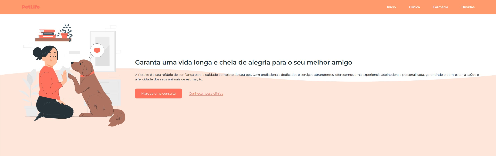
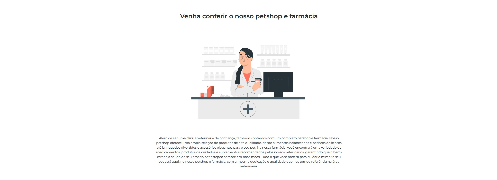

# 🐾 PetLife

## 🇧🇷 Português (PT-BR)
🌟 Garanta uma vida longa e cheia de alegria para o seu melhor amigo!

O PetLife é um site fictício que apresenta uma clínica veterinária, petshop e farmácia. Ele foi desenvolvido com HTML, CSS e JavaScript para oferecer uma experiência interativa e moderna para os usuários.

### 🚀 Tecnologias utilizadas

    HTML5 → Estruturação do site
    CSS3 → Estilização e design responsivo
    JavaScript → Interatividade nas seções de dúvidas

### 🎯 Funcionalidades

✔️ Página inicial com introdução sobre a clínica
✔️ Seção sobre os serviços veterinários oferecidos
✔️ Informações sobre o petshop e farmácia
✔️ FAQ interativo para esclarecer dúvidas dos clientes
✔️ Design moderno e amigável

### 📷 Capturas de tela

### 🛠 Como executar o projeto

1️⃣ Clone este repositório:

git clone https://github.com/Israel-Matheus/Pet-Life.git

2️⃣ Acesse a pasta do projeto:

cd Pet-Life

3️⃣ Abra o arquivo index.html em qualquer navegador.

### 📌 Melhorias futuras

    Tornar o site responsivo para dispositivos móveis
    Adicionar um sistema de agendamento de consultas
    Integrar um backend para gerenciamento de clientes

### 📜 Licença

Este projeto foi desenvolvido para fins educacionais e não possui fins comerciais.  
Página web desenvolvida para a trilha Start na Programação da OneBitCode.

---
   
## 🌐 English (EN)
🌟 Ensure a long and joyful life for your best friend!

PetLife is a fictional website that showcases a veterinary clinic, pet shop, and pharmacy. It was built using HTML, CSS, and JavaScript to deliver a modern and interactive experience for users.
🚀 Technologies Used

    HTML5 → Website structure
    CSS3 → Styling and responsive design
    JavaScript → Interactivity in the FAQ section

🎯 Features

✔️ Homepage with an introduction to the clinic
✔️ Section about veterinary services offered
✔️ Information about the pet shop and pharmacy
✔️ Interactive FAQ to answer common customer questions
✔️ Modern and user-friendly design
📷 Screenshots

    PetLife - Home
    PetLife - Clinic
    PetLife - Pharmacy
    PetLife - FAQ

🛠 How to Run the Project

1️⃣ Clone this repository:

git clone https://github.com/Israel-Matheus/Pet-Life.git

2️⃣ Navigate to the project folder:

cd Pet-Life

3️⃣ Open the index.html file in any web browser.
📌 Future Improvements

    Make the website fully responsive for mobile devices
    Add an appointment scheduling system
    Integrate a backend for client management

📜 License

This project was developed for educational purposes only and has no commercial intent.
